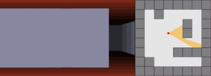

# Wolf3d
**NAIVE** Ray casting algorithm game engine

## Descriptioin:
Simple ray casting map animation. Ability to create own map with ppm3 format textures on walls, ability to change map in game. Linux, MacOS support.

Ray casting algorithm explanation:


## Build:
```
make
```

## Usage:
- **Run**
```
./wolf3d
```
- **Walk**
  - press arrows 
- **Change map**
  - Press 'm' in game and write map name in console
- **Create map**
  - add map to "./materials/maps/[map name]"
  ```
  2 3
  1 0 4
  1 0 0
  ```
    where 2 is hight, 3 - width, 0 is empty, 1 is wall with type '1', 4 - with type '4'
  - add map to "./materials/maps.list" like
  ```
  map(./materials/maps/42.fdf)
  {
	  name(42_fdf)
	  person_x(10)
	  person_y(9.54)
	  person_alp(0)
  }
  ```
- **Add texture**
  - add ppm3 format file to "./materials/textures/[texture name].ppm"
  - add texture to "./materials/textures.list" like
  ```
  folder(./materials/textures/)
  {
	  texture(art.ppm)
	  texture(boar.ppm)
  }
  ```
- **Create wall type**
  - add type to "./materials/wall_types.list" like
  ```
  type(1)
  {
	  north(art.ppm)
	  south(boar.ppm)
  	east(brick.ppm)
	  west(nan.ppm)
  }
  ```

## Screenshots:


